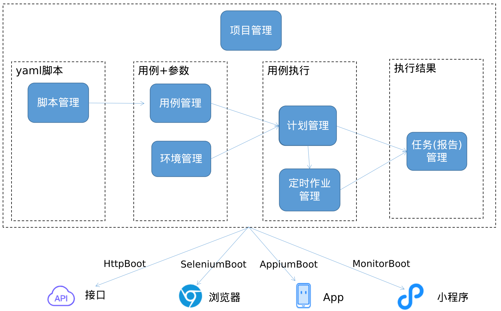

# jktest

## 概述
jktest 是自动化测试平台，涵盖4端自动化测试(接口自动化+浏览器自动化+app自动化+小程序自动化)和性能测试等，能快速落地自动化测试，以实现持续测试持续集成，加速软件的高质量交付，提升整个研发团队的效率。

本网站是文档，代码暂未开源。

### 四端自动化测试技术的意义：构建出一套yaml驱动的自动化测试技术体系
通过扩展Locust/Selenium/Appium/Minium技术，统一使用yaml来写4端的自动化测试脚本，无需写一行python代码，yaml作为dsl封装了4端常用的操作(如发http请求、上下左右滑动、放大缩小、校验、提取变量等），也支持if/for语义，大大降低了自动化测试的学习成本、开发成本与维护成本，极大的提高了测试伙伴的效率，从而实现低成本的持续测试。
简单来说，不用招测开工程师，直接用功能测试伙伴就能做四端自动化测试。
1. 接口自动化与压测：[HttpBoot](https://github.com/shigebeyond/HttpBoot)
2. 浏览器自动化：[SeleniumBoot](https://github.com/shigebeyond/SeleniumBoot)
3. app自动化：[AppiumBoot](https://github.com/shigebeyond/AppiumBoot)
4. 小程序自动化：[MiniumBoot](https://github.com/shigebeyond/MiniumBoot)

### jktest测试平台的意义：整合与打通了4端自动化测试技术
通过web界面来维护与执行4端自动化测试的yaml脚本
1. 触发自动化测试用例执行，有3种触发类型：手动触发、定时触发、url触发；
2. 不同端的用例可以关联调用，如一个流程可能包含浏览器后台操作与app操作； 
3. 自动出报告

## 主要功能
1. [首页](doc/home.md)
2. [管理员与权限管理](doc/manager_role.md)
3. [项目管理](doc/project.md)
4. [脚本管理](doc/yaml.md)
5. [用例管理](doc/case.md)
6. [环境管理](doc/env.md)
7. [计划管理](doc/plan.md)
8. [定时作业管理](doc/job.md)
9. [任务(报告)管理](doc/task.md)

## 演示视频
[视频演示了浏览器与app自动化测试用例及计划的执行](https://www.zhihu.com/zvideo/1630268717249634304)

## 概念说明
1. 系统: 每个独立部署的 jktest 即称为一套系统。
2. 权限机制：基于角色的访问控制(RBAC)
3. 管理员：能登录与操作 jktest 系统的用户，要绑定角色才有操作权限。
4. 权限：代表可访问的资源(如数据或功能)，有2类权限：菜单与规则(后端接口)。
5. 角色：代表一种授权，可理解为多个权限的集合，每个角色拥有不同的权限。
6. 项目：jktest 系统以项目维度来管理各种类型测试数据，各个项目间数据隔离。
7. 脚本：用yaml编写的自动化测试脚本，需要用HttpBoot/SeleniumBoot/AppiumBoot/MiniumBoot技术来执行。
8. 用例：自动化测试用例，要指定yaml脚本与自动化技术类型(HttpBoot/SeleniumBoot/AppiumBoot/MiniumBoot)。 用例不能单独执行，需挂在计划中才能执行。
9. 环境：诸如开发环境、测试环境、预发布环境、生产环境等，用于包含特定环境相关的变量，这些变量用于执行用例。
10. 计划：自动化测试计划，需指定该计划要执行的用例与环境(变量)。 计划是自动化测试的真正触发主体，有3种触发类型：1 手动触发 2 定时触发 3 url触发
11. 任务：代表一次计划执行。有4种状态：0未执行 1执行中 2 成功 4失败
12. 报告：代表计划执行(任务)的结果，记录计划中所有用例的执行情况。

## 技术栈
### 1 后端
python + flask + sqlalchemy

同时也对上述框架做了扩展与规范：
1. model层抽取了`ModelMixin`基类，增加了对关联查询、序列化、逻辑与物理删除、增删改规范调用、增删改事件等的支持；
2. 新增装饰器`@transaction`与`@classTransaction`来包装事务处理；
3. 新增装饰器`require_login`来校验登录，`require_role`来校验角色，`require_rule`来校验权限，`require_token`来校验token（token用在远程执行计划的url中）；
4. 仿jwt来实现token机制；
5. 定制蓝图约定，来简化蓝图注册：逐个扫描目录`controllers`下的python文件，注册其中有`@bp.route`修饰的方法来做蓝图；
6. 支持不同环境加载不同的yaml配置文件。

### 2 前端
vue3

### 3 中间件
mysql + redis
   
### 4 代码生成器
用我实现的第二代代码生成器，支持对以下技术的代码生成：

1. 支持小程序

2. 支持uniapp

3. 支持2个前端框架: layui2.5, vue3.

4. 支持3个后端语言与框架

| 语言 | 框架 |
| ------------ | ------------ |
| kotlin/java | jkmvc |
| python | flask2.2+sqlalchemy |
| php | CodeIgnier3 |

### 4 四端自动化测试引擎及其扩展库
1. requests + [HttpBoot](https://github.com/shigebeyond/HttpBoot);
2. locust + [LocustBoot](https://github.com/shigebeyond/HttpBoot/blob/master/locust.md);
3. selenium + [SeleniumBoot](https://github.com/shigebeyond/SeleniumBoot);
4. appium + [AppiumBoot](https://github.com/shigebeyond/AppiumBoot);
5. minum + [MiniumBoot](https://github.com/shigebeyond/MiniumBoot)

