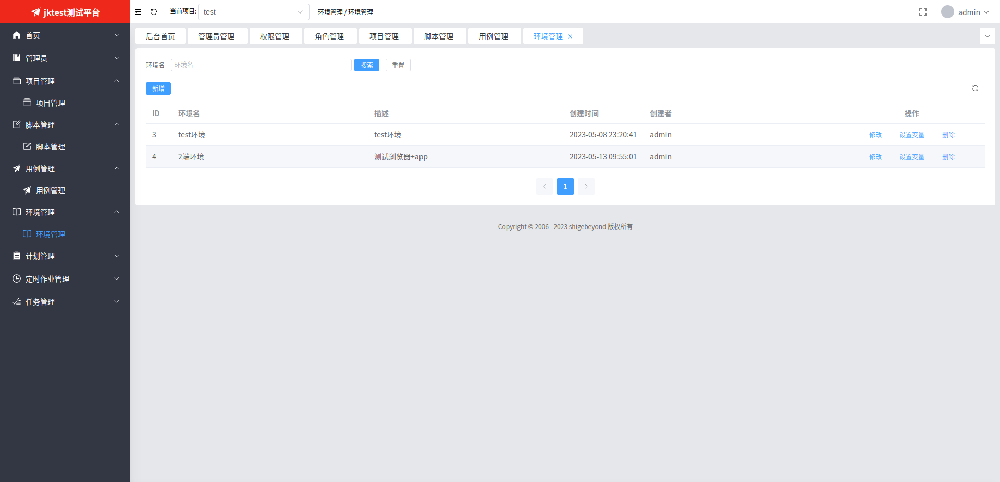
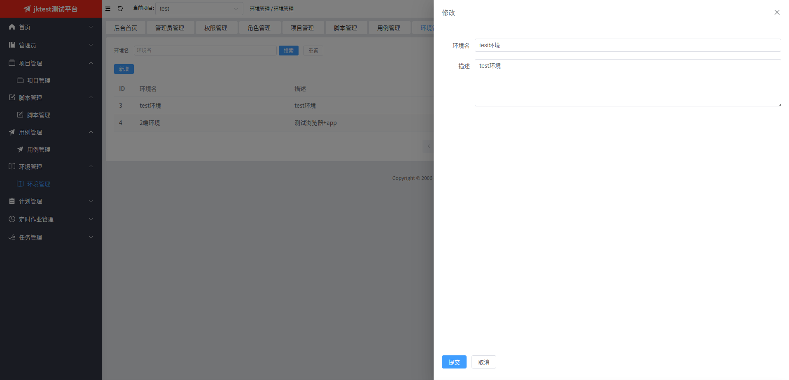
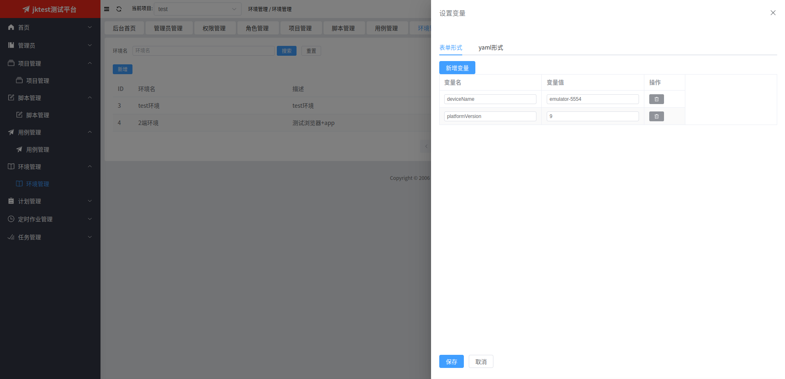
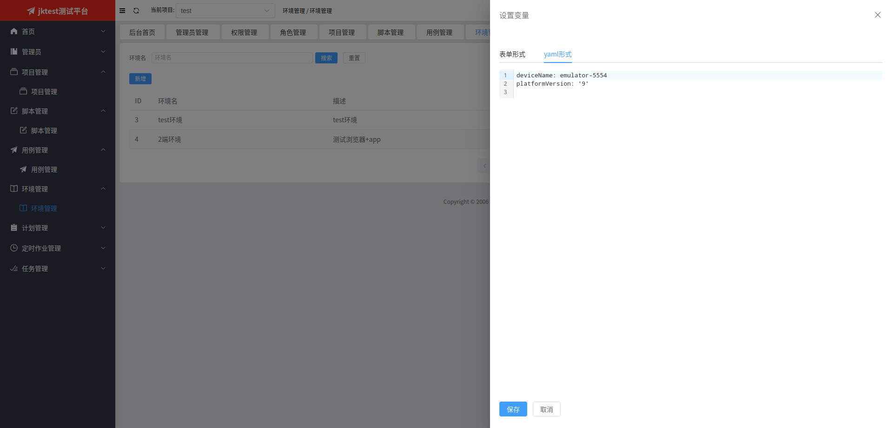

# 环境管理
环境，诸如开发环境、测试环境、预发布环境、生产环境等，用于包含特定环境相关的变量。

在计划中绑定某个环境，即可使用该环境相关的变量来运行计划中的用例脚本。

## 1. 环境列表

   
## 2. 新增或修改环境
点击【新增】或【修改】按钮会弹出下面的表单页，在填写相关信息后，点击【提交】按钮即可。

   
## 3. 设置变量
点击【设置变量】按钮会弹出下面的表单页，在填写相关信息后，点击【保存】按钮即可。

