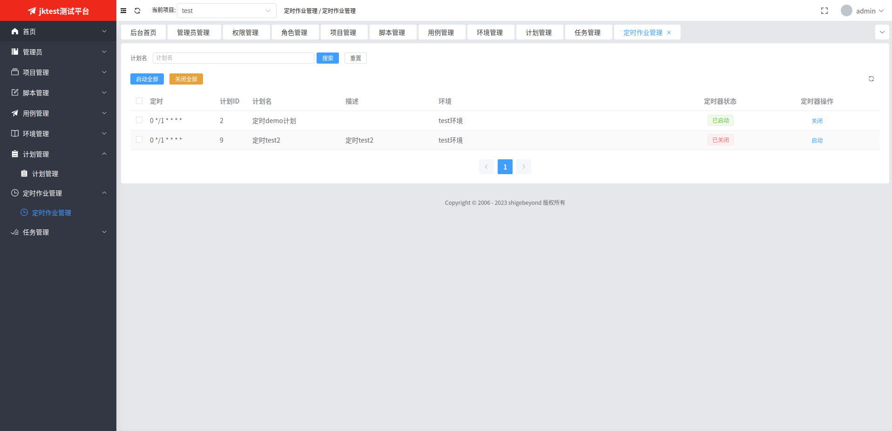

# 定时作业管理
定时作业，即是配置了`定时`字段的计划。

一个定时作业，对应一个定时器，定时器默认是关闭状态，需要手动启动后才能定时触发计划执行。

## 1. 定时作业列表

   
## 2. 启动定时器
2.1 点击【启动】按钮，会启动单个定时器；

2.2 点击【启动全部】按钮，会启动勾选的多个定时器；

## 3. 关闭定时器
3.1 点击【关闭】按钮，会关闭单个定时器；

3.2 点击【关闭全部】按钮，会关闭勾选的多个定时器；