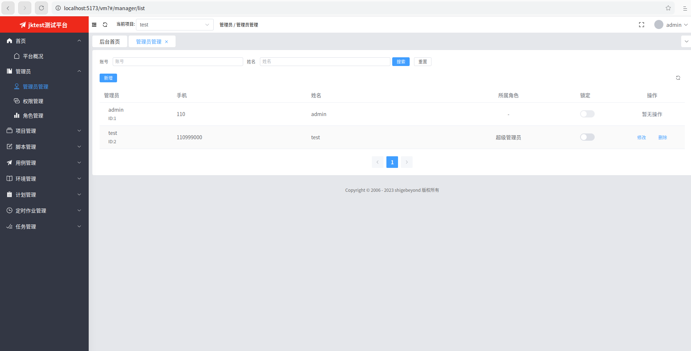
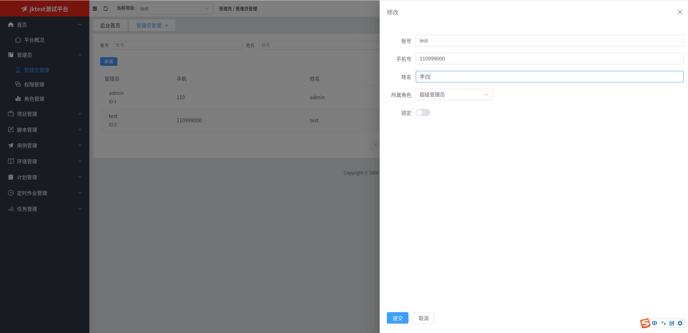
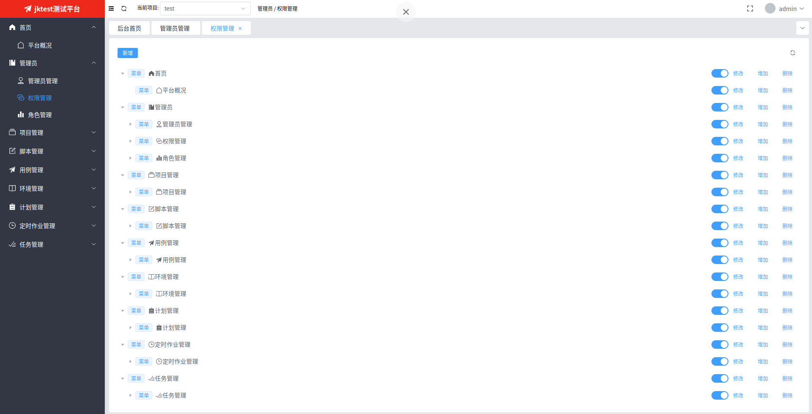
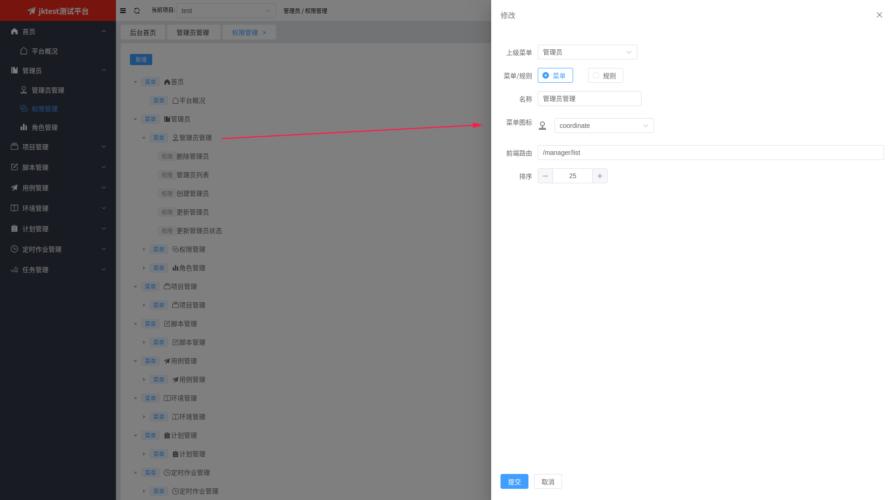
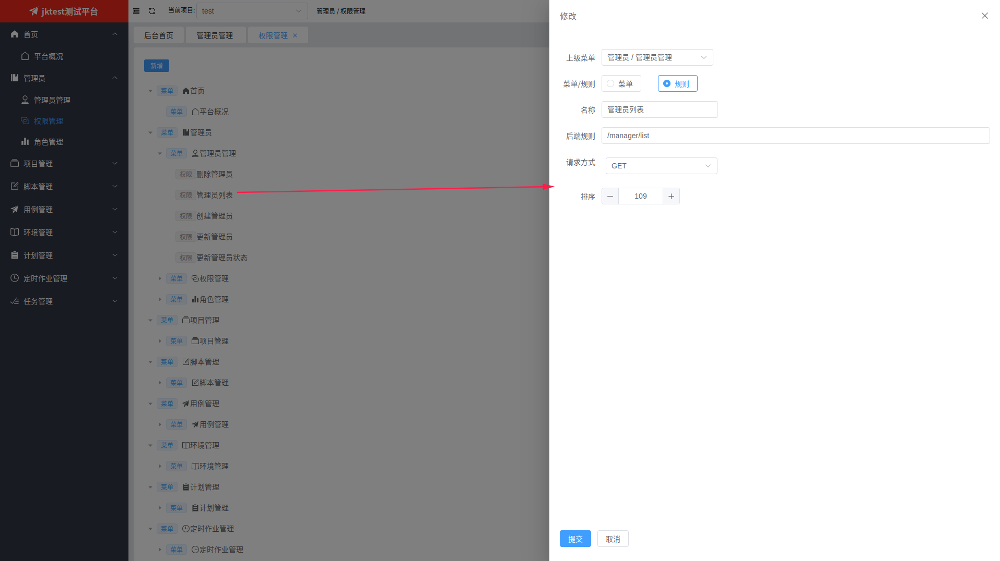
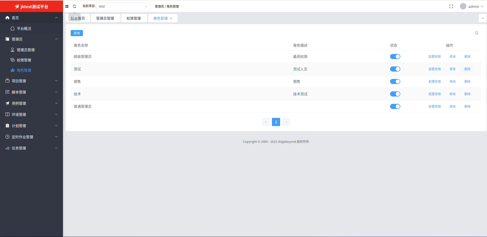
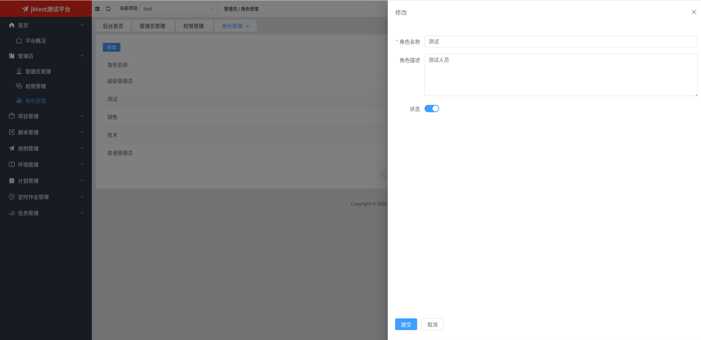
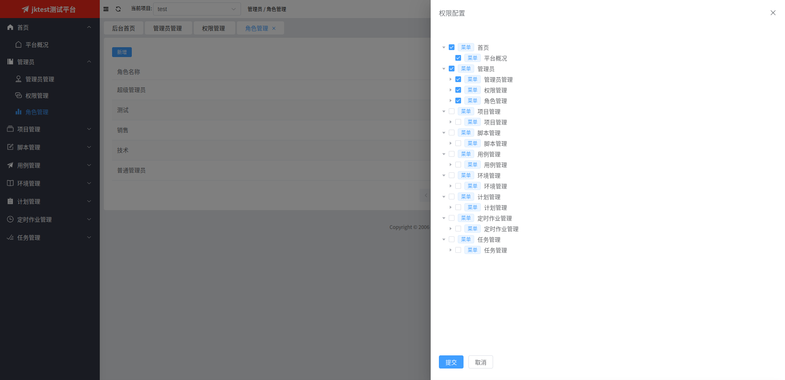

# 一、管理员管理
## 1. 管理员列表

   
## 2. 新增或修改管理员
点击【新增】或【修改】按钮会弹出下面的表单页，在填写相关信息后，点击【提交】按钮即可。

# 二、权限管理
## 1. 权限列表

   
## 2. 新增或修改权限
点击【新增】或【修改】按钮会弹出下面的表单页，在填写相关信息后，点击【提交】按钮即可。 

由于权限有2个类型：菜单 + 规则(后端接口)，因此操作页面有所不同
### 2.1 菜单类型权限的表单页

### 2.2 规则(后端接口)类型权限的表单页

# 三、角色管理
## 1. 角色列表

   
## 2. 新增或修改角色
点击【新增】或【修改】按钮会弹出下面的表单页，在填写相关信息后，点击【提交】按钮即可。 

   
## 3. 给角色授权
点击【配置权限】按钮会弹出下面的表单页，在勾选想要的权限后，点击【提交】按钮即可。

