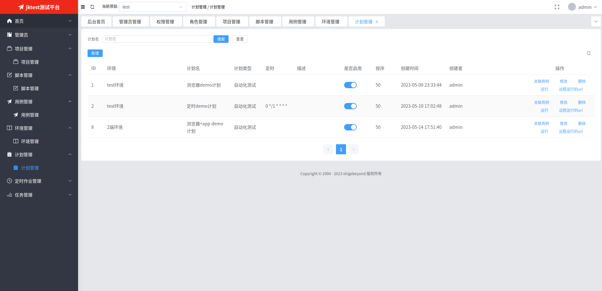
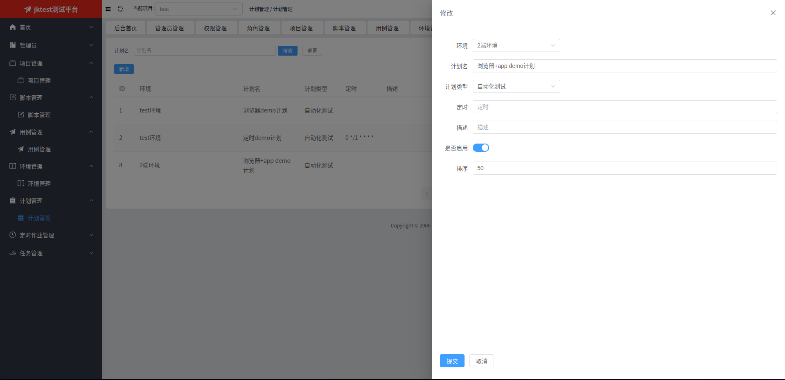
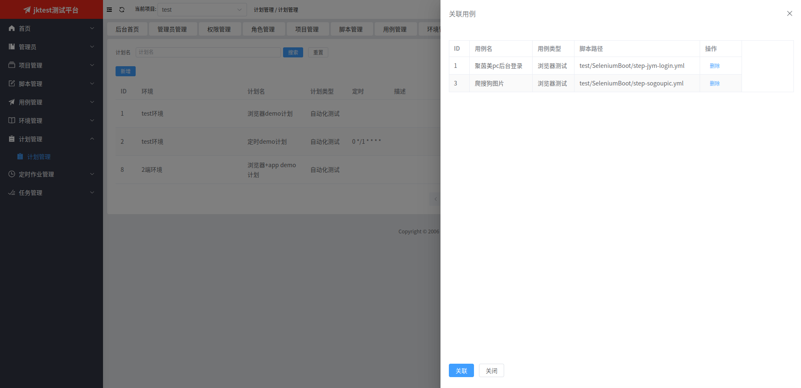
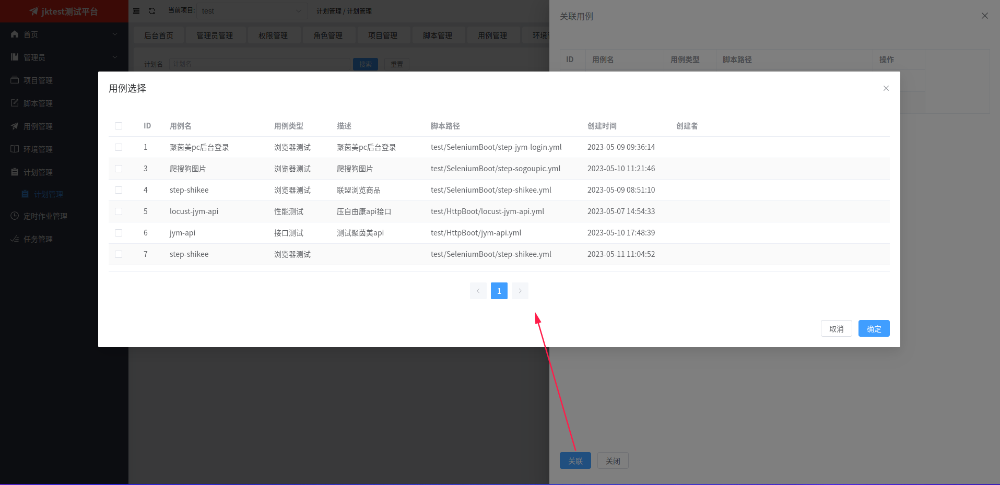
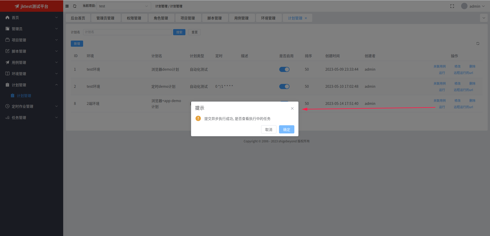
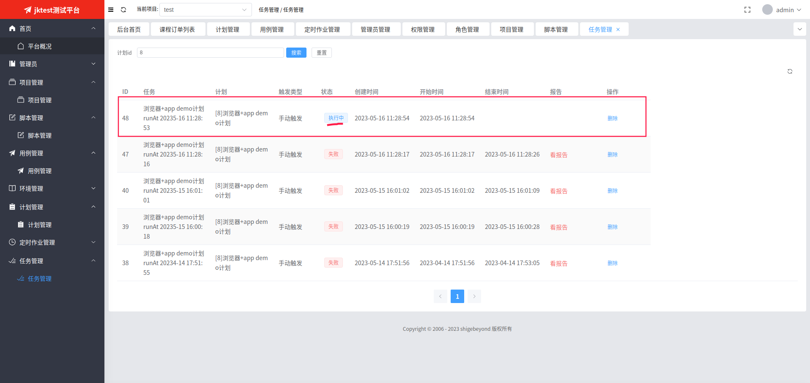
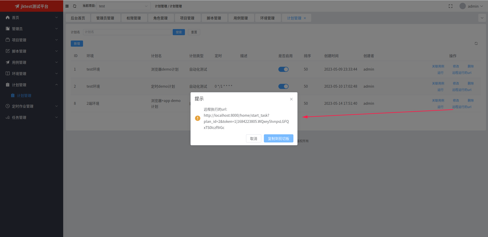

# 计划管理
自动化测试计划，需指定该计划要执行的用例与环境(变量)。

计划是自动化测试的真正触发主体，有3种触发类型：1 手动触发 2 定时触发 3 url触发

## 1. 计划列表

## 2. 新增或修改计划
点击【新增】或【修改】按钮会弹出下面的表单页，在填写相关信息后，点击【提交】按钮即可。

   
## 3. 关联用例
点击【关联用例】按钮会弹出与该计划关联的用例列表页

   
## 4. 选择关联用例
点击【关联】按钮会弹出用例选择页面，勾选想要的用例后点击【确认】按钮即可。

## 5. 执行计划
点击【运行】按钮会立即执行计划（生成任务），并弹出以下提示框。

点击提示框中的【确定】按钮，会跳转到任务列表，来查看任务的执行情况。

## 6. 远程执行
点击【远程运行的url】会弹出一个url，在任何地方访问该url即可触发对应计划的执行。

