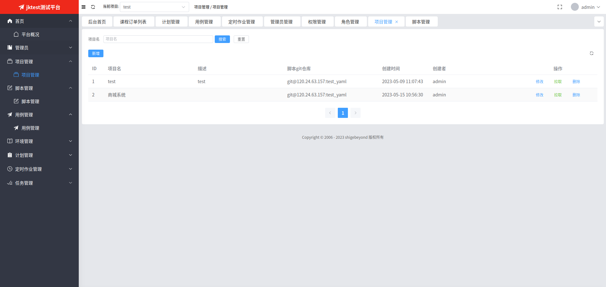
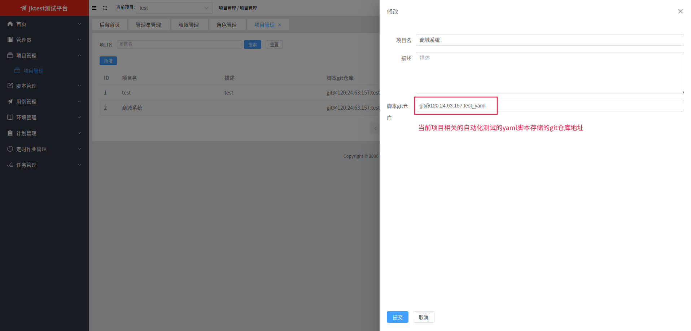
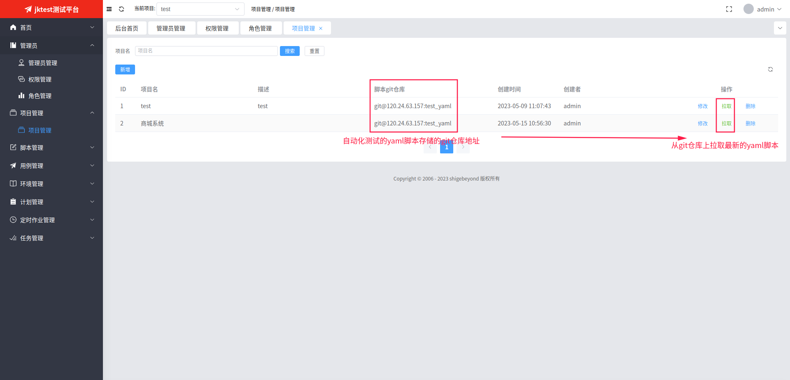
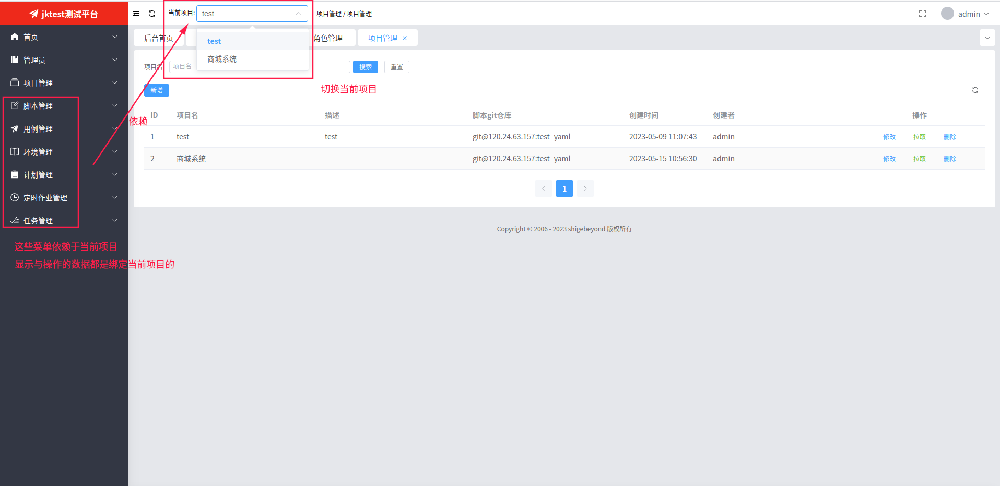

# 项目管理
jktest 系统以项目维度来管理各种类型测试数据，各个项目间数据隔离。

## 1. 项目列表

## 2. 新增或修改项目
点击【新增】或【修改】按钮会弹出下面的表单页，在填写相关信息后，点击【提交】按钮即可。

## 3. 拉取代码
点击【拉取】按钮会从git仓库上拉取最新的yaml脚本代码

## 4. 切换当前项目
点击左上方的当前项目下拉菜单，菜单中列出了所有项目列表，点击某个项目进行切换
