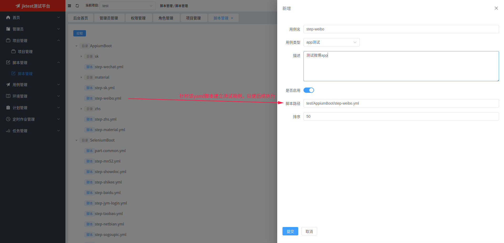

# yaml脚本管理
yaml脚本，是用yaml编写的自动化测试脚本，需要用HttpBoot/SeleniumBoot/AppiumBoot/MiniumBoot技术来执行。

## 1. 脚本列表

   
## 2. 查看代码
点击【看代码】按钮，会弹出以下界面

## 3. 创建用例
点击【建用例】按钮，会弹出新增用例的表单页，会自动填充当前脚本路径，然后在填写其他信息后，点击【提交】按钮即可。

## 4. 查看相关用例
点击【看用例】按钮，会跳转到用例列表页，并按yaml脚本路径来过滤用例
